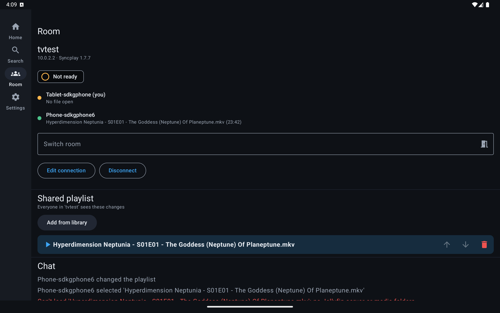

# SyncplayTV

A [Syncplay](https://syncplay.pl/) client for Android TV / Google TV, phones, tablets and Windows, macOS and Linux
desktops, with [mpv](https://mpv.io/) built in. Media comes from your [Jellyfin](https://jellyfin.org/) server on
the local network or from files on the device.

- Joins any Syncplay server/room; play, pause and seek are synchronised with desktop Syncplay users.
- Plays through libmpv (hardware decoding with software fallback, libass subtitles, audio/subtitle track switching).
- Browses Jellyfin libraries (Quick Connect or username/password login).
- Shared playlists: when someone selects an entry, the app finds that filename in your media folders or Jellyfin
  and loads it automatically.
- One APK: the remote-friendly TV UI on Google TV, a touch UI on phones (bottom navigation) and tablets
  (navigation rail). On phones and tablets you can also open a single video, use "Open with" from a file
  manager, or add media folders that work like Syncplay's media directories.
- A desktop app with the same UI plus a side panel that edits the room's playlist and chats the way the
  desktop Syncplay client does.
- Each room's playlist is remembered per server and put back when you rejoin a room whose playlist is empty
  (Settings > Remember room playlists).



## Download

The [download page](https://yarmiplay.github.io/SyncplayTV/) has a card per device type (Google TV, Android
phone and tablet, Windows, macOS, Linux) and highlights the one for the device you open it on. On a TV, enter
`https://yarmiplay.github.io/SyncplayTV/a` in the Downloader app to get the APK directly.

The page is built by `scripts/download_site.py` and published by `.github/workflows/pages.yml` after every
green `Build` run on `main` (or by hand from the Actions tab). It contains every artifact of that run whose
name starts with `syncplaytv-`. Files are matched to platforms by extension (`.apk`, `.msi`/`.exe`,
`.dmg`/`.pkg`, `.deb`/`.rpm`/`.AppImage`). Platforms without a package show how to run from source. To
preview it locally:

```powershell
python scripts/download_site.py --dist app/build/outputs/apk/debug --out build/site
python -m http.server -d build/site 8000
```

## Desktop app

Installers come from the `desktop` CI job (and the download page):

- **Windows:** `.msi` or `.exe`, installed per user; libmpv is included.
- **macOS:** `.dmg` (Apple Silicon, not notarized: right-click the app and choose Open the first time).
  It uses Homebrew's libmpv, so run `brew install mpv` first.
- **Linux:** `.deb` for Ubuntu 22.04+ and Debian 12+; `sudo apt install ./syncplaytv_*.deb` also installs
  libmpv.

Open a video from the home screen, drop files or folders on the window, or use "Open with" on a video.
In a room, the player's playlist, room and chat buttons open a side panel:

- **Playlist:** add videos, a folder or URLs, drop files while the tab is open, drag or Alt+↑/↓ to
  reorder, Ctrl/Shift-click to select several, Delete to remove, Ctrl+Z to undo (anyone's last change),
  double-click to play, shuffle, loop options, and save/load the list as a text file.
- **Chat:** Enter in the player opens it; ↑/↓ recall what you sent.

Player keys: Space or K pauses, ←/→ or J/L seek, ↑/↓ change the volume, F or F11 toggles full screen,
Esc leaves full screen or goes back. The command line follows the official client:
`SyncplayTV [--host host[:port]] [--name name] [--room room] [--password pw] [file]`.

From source (downloads the pinned libmpv on Windows; use `brew install mpv` or `sudo apt install libmpv2`
elsewhere):

```powershell
./gradlew :desktop:run --args="--host localhost:8999 --room tvtest D:/Videos/episode.mkv"
./gradlew :desktop:packageDistributionForCurrentOS     # installers in desktop/build/compose/binaries
./gradlew :player-mpv-desktop:test :desktop:test       # libmpv playback, the side panel (needs SYNCPLAY_TEST_SERVER)
./scripts/e2e-desktop.ps1                              # phone leads; TV and desktop follow; official client watches
```

## Project layout

| Module | What it is |
| --- | --- |
| `syncplay-protocol` | Pure Kotlin Syncplay protocol client (JSON over TCP, optional TLS) |
| `media-source` | `MediaSource` interface and the Jellyfin implementation (pure Kotlin, OkHttp) |
| `player-mpv` | libmpv wrapper exposing a small `Player` interface |
| `shared` | Kotlin Multiplatform (Android and desktop): phone/tablet/desktop UI, `SyncController`, `PlaylistController`, settings, local library |
| `app` | The Android app: TV UI (Compose for TV) and the Android side of `shared` |
| `player-mpv-desktop` | libmpv on the desktop through JNA, rendered with OpenGL (or software) into Compose |
| `desktop` | The desktop app (Compose for Desktop): window, shortcuts, drag and drop, installers |

## Development on Windows

```powershell
# One-time: JDK 17, Android SDK, emulator, Google TV and phone system images
./scripts/setup-toolchain.ps1

# One-time: create the emulators (GoogleTV_1080p, GoogleTV_4K, Phone_Pixel8, Tablet_Pixel)
./scripts/create-avds.ps1                 # or -Kind tv / -Kind phone,tablet

# Build, boot the emulator, install and launch (prints the serial, e.g. emulator-5556)
./scripts/run-tv.ps1                      # 1080p Google TV
./scripts/run-app.ps1 -Avd Phone_Pixel8   # phone; boots next to a running TV
./scripts/run-app.ps1 -Avd Tablet_Pixel -NoBuild
./scripts/run-app.ps1 -Avd Phone_Pixel8 -Ui tv   # debug: force the TV UI

# Send remote-control keys to the emulator
./scripts/remote.ps1 down down ok back
./scripts/remote.ps1 -Text "Neptunia"

# Touch input: tap/swipe by coordinates, rotate the screen
./scripts/remote.ps1 -Serial emulator-5554 tap 540 1200 swipe 540 1800 540 600 rotate landscape

# Tap by visible text, content description or Compose test tag (works in the system file picker too)
./scripts/ui.ps1 -Serial emulator-5554 -List
./scripts/ui.ps1 -Serial emulator-5554 -Id tab_Room
./scripts/ui.ps1 -Serial emulator-5554 "Use this folder" -Wait 10

# Screenshot an emulator (saved under %TEMP%\syncplaytv-shots, path is printed)
./scripts/screenshot.ps1 -Name home
./scripts/screenshot.ps1 -Serial emulator-5554 -Name phone-home
```

With several emulators running, pass `-Serial` to the scripts. The phone and tablet images include the
Play Store's Gboard, whose stylus tutorial swallows scripted text; `run-app.ps1` turns it off.

### Installing on a real TV

```powershell
./scripts/serve-apk.ps1            # builds the debug APK and serves it on port 8080
```

It serves the same download page as GitHub Pages, with your local build. On the TV, open the printed
`http://<pc-ip>:8080/` in a browser, or install the free **Downloader** app
(by AFTVnews) and enter `http://<pc-ip>:8080/a` for a direct download. Allow that app to install unknown apps
when Android asks, then open the file and choose Install. Re-run the script after changes and download again
to update. Debug builds are signed with this PC's debug key, so an APK from CI (different key) can't update a
locally built install without uninstalling first.

### Installing on a phone or tablet

It's the same APK. With the server above running, open `http://<pc-ip>:8080/` in the phone's browser, tap
the download, and allow the browser to install unknown apps when asked. With USB debugging enabled you can
also run `adb install -r app/build/outputs/apk/debug/app-debug.apk`.

On a phone or tablet:

- **Local files.** Use "Files on this device" to open a single video, or add a folder such as `Movies`.
  When the room's playlist moves to a file, the app looks for that filename in your folders first, then in
  Jellyfin, so a friend's desktop Syncplay sees the same file.
- **Player controls.** The player goes fullscreen in landscape. Tap to show the controls. Double-tap the
  left or right side to seek, or the middle to pause. The playlist, room, chat and track panels open as
  bottom sheets.
- **Background playback.** Keep the app in front while watching. Android cuts network access for apps in
  the background, so the room connection drops after a few seconds. It reconnects and resyncs
  automatically when you come back.

Inside the emulator, the host PC is `10.0.2.2`, so a Jellyfin server on this PC is `http://10.0.2.2:8096`
and a Syncplay server on this PC is `10.0.2.2:8999`. The player overlay auto-hides after 6 seconds, so
send key sequences in a single `remote.ps1` call.

### Unit and integration tests

```powershell
./gradlew :syncplay-protocol:test :media-source:test

# Protocol test against a real syncplay-server (see below)
$env:SYNCPLAY_TEST_SERVER = "127.0.0.1:8999"; ./gradlew :syncplay-protocol:test

# Live Jellyfin test (optional)
# (API key from Jellyfin Dashboard > API Keys, user id from the user's profile URL; keep these out of the repo)
$env:JELLYFIN_URL = "http://localhost:8096"; $env:JELLYFIN_TOKEN = "..."; $env:JELLYFIN_USER_ID = "..."
$env:JELLYFIN_RESOLVE = "Some Show - S01E01 - Title.mkv"
./gradlew :media-source:test --tests "*LiveJellyfinTest*"
```

### Instrumented tests (phone emulator)

Compose UI and playback tests in `app/src/androidTest` cover:

- device detection;
- navigation;
- the connect and settings forms;
- player gestures and sheets;
- playing a generated test clip through a `content://` URI.

Run them on a booted `Phone_Pixel8`:

```powershell
./gradlew :app:connectedDebugAndroidTest
```

If Gradle can't clean its result folders (OneDrive sometimes locks them), install both APKs and run the
tests through adb instead:

```powershell
./gradlew :app:assembleDebug :app:assembleDebugAndroidTest
adb install -r -t app/build/outputs/apk/debug/app-debug.apk
adb install -r -t app/build/outputs/apk/androidTest/debug/app-debug-androidTest.apk
adb shell am instrument -w -r com.syncplaytv.test/androidx.test.runner.AndroidJUnitRunner
```

CI (`.github/workflows/build.yml`) does four things:

- runs the unit tests and the protocol test against a real Syncplay server;
- runs the instrumented tests on an API 34 phone emulator;
- tests the desktop app on Windows, macOS and Ubuntu, builds its installers, and installs and plays the
  `.deb` on Ubuntu;
- uploads the debug APK as an artifact, which `pages.yml` then publishes on the download page.

### Testing sync locally

```powershell
./scripts/local-syncplay-server.ps1    # clones Syncplay, runs its server on port 8999
```

Connect the TV app to `10.0.2.2:8999` and join a room (e.g. `tvtest`). A phone emulator running next to it
can join the same room. Push a video with `adb -s emulator-5554 push episode.mkv /sdcard/Movies/` and add
the `Movies` folder in the app; it then resolves that filename locally while the TV uses Jellyfin. Then either:

**A desktop Syncplay client with mpv** (run from the same source checkout, no install needed besides mpv):

```powershell
winget install shinchiro.mpv
.tools\syncplay-venv\Scripts\python.exe .tools\syncplay-src\syncplayClient.py --no-gui --no-store `
    -a 127.0.0.1:8999 -n Desktop -r tvtest --player-path "C:\Program Files\mpv\mpv.exe" "D:\path\to\episode.mkv"

# Drive that desktop mpv from a script (play / pause / seek / get <property>)
python scripts/mpv_ipc.py seek 600
python scripts/mpv_ipc.py get time-pos
```

**Or the scripted peer** `scripts/fake_peer.py` (stdlib only), which speaks the protocol with a virtual clock and
fails with exit code 1 when an expectation isn't met:

```powershell
python scripts/fake_peer.py --room tvtest --name Peer --script (
  "wait 2; playlist Some Show - S01E01 - Title.mkv; select 0; wait 10; expect-user TV ready=true; " +
  "ready; play; expect-room paused=false; seek 300; expect-room position~300; wait 3; drift -7; wait 4; status; quit")
```

The TV should resolve the playlist entry through Jellyfin, load it, report the same file and mark itself ready,
then follow the peer's unpause and seek, slow down for small drifts and rewind for large ones.


## License

Apache 2.0, same as Syncplay.
